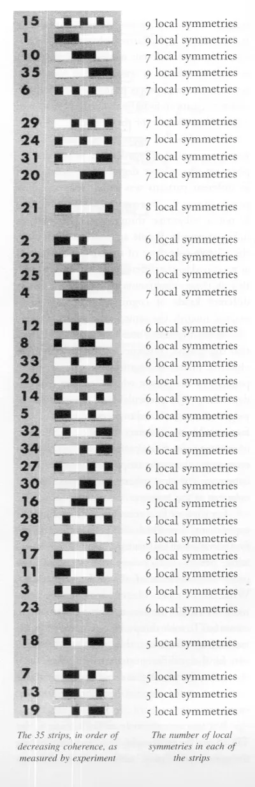

# Awareness Test

> The fact that _local_ symmetries work to create coherence, while _overall_ symmetry rarely does, was dramatically illustrated by an experiment I did many years ago while working at the Harvard Center for Cognitive Studies. In this experiment, I compared a number of black and white paper strips, and measured their coherence as felt, experienced, perceived, remembered, by different experimental subjects. The black and white strips I used are shown [below], in order of their coherence (as measured by my experiments).



> [...] We found that, whether we used ease of description, ease of memorization, subjectively judged "simplicity", or ease of recognition in a tachistoscope, the relative coherences as measured by these different experiments were very strongly correlated. [...] Two important results emerged. First, in any one experiment, the relative degree of coherence seen in different patterns was rather constant from person to person. This means that the coherence is not a subjective thing seen differently by different people. People agree about it. Second, the relative coherence of the different patterns, as measured by the different experiments — even though these experiments were based on widely different kinds of cognitive processing — remained roughly the same.
>
> —Christopher Alexander, _The Phenomenon of Life_, pp. 188–89

> It is not always easy to see the wholeness which exists in the world. [...] I was astonished, many years ago, in the course of an experiment I was doing with Radcliffe students, that most of them did _not_ see the wholeness of simple patterns. They saw, instead, a distorted picture of these patterns, viewed them with arbitrary intellectual devices rather than responding to the deeper wholeness that was present in them. [...] On the other hand, in other experiments, we found that young children routinely saw the wholeness [...].
>
> In a second series of experiments which Huggins and I also did with Radcliffe students, we found out that it is extremely difficult to teach a person to see holistically once she has been educated to see sequentially. We tried to devise forms of training which would move a person's perception toward perception of wholeness. [...] Only one technique that we ever found successfully changed a person's perception toward holistic.
>
> The successful technique went like this: The subject was shown one of the thirty-five patterns and allowed to look at it for a few seconds, until she knew which one it was. She was then shown a large rectangular array of thirty-five different patterns jammed up close to each other in a very confusing way, and without any visible order to the arrangement. This array was flashed on a screen for just one second. During this one second, the subject had to find the particular pattern she had been shown. [...]
>
> Under these conditions, looking at the patterns one by one just doesn't work. There isn't time to do it. But under the pressure of the experiment's one second deadline, doing it again and again, subjects gradually found a way in which they could find the pattern they were looking for, in the one second they had available. What they did, and had to do, to make it work was to gaze in a blank, unfocused fashion at the whole array, trying to allow themselves to be blank, receptive, and to see the board all at once. Try it yourself. In this receptive mode, you have to move "back" mentally, away from the patterns, and then begin to see differently: you almost have to let your eyeballs move backward in your head. Mentally you back away from the screen, and open your eyes very wide, so you are not looking for anything in particular, but see everything. _This forces you to see "the whole."_
>
> —Christopher Alexander, Appendix 3 to _The Phenomenon of Life_, pp. 453–56.

## Development

### One-time Setup

1. Click the "Use this template" button on GitHub
2. Clone the created repo
3. Run the one-time setup script to install dependencies and git hooks:
   ```
   yarn setup
   ```

### Server and Typechecker

```
yarn dev
yarn ts
```

- Opening the project in **Visual Studio Code** automatically starts the dev server and `typescript` typechecker.
- The dev server runs at http://localhost:5173 (the port number is `vite` in 1337... sort of).
- Output appears in the terminal pane (accessed via `ctrl+~`).
- Type errors also show up in the problems pane (`ctrl+shift+M`).
- The server and typechecker stop automatically when VS Code quits.

### Tests

http://localhost:5173

- **Tests** run in the browser. The test report appears at the top of the screen.
- The page will refresh (re-running the tests) whenever you save a file.
- The tests and test report are completely removed from production builds.

### Formatting

- Files get auto-formatted when you commit, so you'll never check in inconsistently-formatted code. To disable this behavior, delete `.husky/pre-commit`.
- To format all files, run `yarn format`.
- The code formatter is `prettier`. See `.prettierrc` for configuration.

## Building for production

```
yarn build
```

To smoketest your production build before deploying it, I recommend installing `serve`:

```
yarn global add serve
serve dist
```

You can then view your app at http://localhost:3000.

## Deploying

To deploy your built app to GitHub Pages, go to the `Pages` tab of your repo's settings and change the directory to deploy from to `/docs`.

This template repo is deployed at https://benchristel.github.io/preact-typescript-vite-taste/
